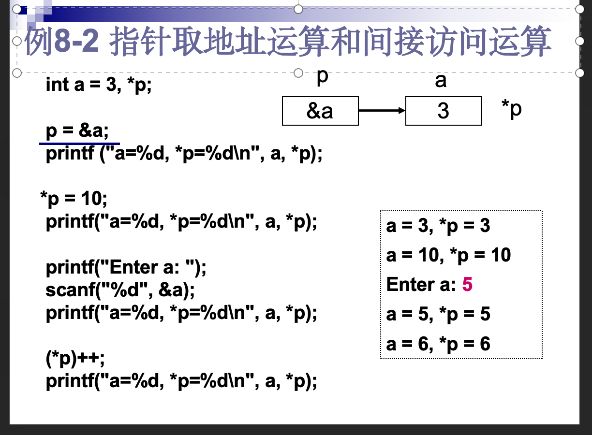

# 基础1
1. C程序中定义的变量，代表内存中的一个存储单元。 T
2. 在C语言中，单目运算符需要**1**个操作数。
3. 单目运算符
    - 加减是正负号的时候
    - ！逻辑非
4. 双目运算符：
    - \+ - * / %
    - || &&
5. 变量名
    - 数字，字母，'_'
    - 不能以数字开头
    - 关键字 int for void...（printf是函数名，不是关键字，可以用作变量名，但这个函数得换一个名）
6. 程序总是从main函数开始执行的 T
7. 假设赋值运算符的优先级比算术运算符高，执行以下程序段后，n的值为10。 T
    ```c
    int n; 
    n = 10 + 2;
    ```
8. 如果变量已经正确定义，则执行以下程序段后，x的值不变。F x变成20了！
    ```c
    if (x = 20) {
        y = 1;
    } else {
        y = 0;
    }  
    ```
9.  输入scanf匹配：&lf->double;"x=%lf"->也要输入'x='
10. 输入scanf记得 **'&'** , 否则会报错
11. 要记得初始化
    执行以下程序段，sum的值是55 F
    ```c
    int i, sum;
    for (i = 1; i <= 10; i++){
        sum = sum + i;
    }
    ```
12. scanf自动分类(?)
若x是double型变量，n是int型变量，执行以下语句，并输入3  1.25后，x的值是1.25，n的值是3。
    ```c
    scanf("%d%lf",&n,&x);
    ```
13.   for 循环本质
    ```c
    int i, sum;
    sum = 0;
    for (i = 1; i <= 10; i++){ //in the end i = 11
        sum = sum + i;
    }
    ```
    ```c
    int fahr;
    double celsius;   
    for (fahr = 121 ; fahr <= 125; fahr++) ; 
    //循环体执行了5次，结束时fahr=126
    celsius = 5.0 * (fahr - 32) / 9.0;
    printf("%4d%6.1f\n", fahr, celsius);
    ```
14.   math.h库
    sqrt() fabs() pow() 
    exp(x) -> e**x
    log(x) -> lnx
    log10(x)
15.  ch = getchar(); putchar('o');
16.  编译预处理命令#include <stdio.h>的的作用并不是将标准输入输出库函数的实现代码(定义)包含到当前源文件里，而是引入标准输入输出库的**声明**。
17. 在嵌套使用if语句时，C语言规定else总是**和之前与其最近的且不带else的if配对**
18. 设变量已正确定义，执行以下程序段，顺序输入三个字符'Q'，则输出Q。 F(三个“字符”，' and Q and ')
    ```c
    ch = getchar(); 
    putchar(ch); 
    ```
19. switch语句中 case后必须是常量表达式 ~~case op == '+'~~ ~~小数~~ 且**不能重复**！
    可以是switch(op){case '+': ...}
    - 特殊的重复情况:k=12时会导致重复
    ```c
    n = 10;//???why i wrote it
    switch ( k ) {
        case n%3: printf("one");
        case n%4: printf("two");
        default: printf("zero");
    }
    ```
    switch('\ \\') ok ??直接跳转到default？
    ~~你会拼default吧~~
20. 坑人题
    ```c
    //写出以下程序段的运行结果。请注意，直接填单词，前后不要加空格等任何其他字符。
    mynumber = 38;
    scanf ("%d", &yournumber); 
    if(yournumber == mynumber){ 
        printf("Right");
    }
    if(yournumber > mynumber ){
        printf("Big");
    }else{ 
        printf("Small");
    }
    //输入38->RightSmall
    ```
    ```c
    int  a;
    scanf("%d", &a);
    if(a > 50)  printf("%d", a);
    if(a > 40)  printf("%d", a);
    if(a > 30)  printf("%d", a);    
    //input 46 -> 4646
    ```
    ```c
    for(num = 1; num <= 100; num++){ 
        s = 0;
        do{
        s = s + num % 10;
        num = num / 10;
        }while(num != 0);
        printf("%d\n", s); 
    }
    //循环内的num改变，导致循环错位啦
    ```
    ```c
    scanf ("%d", &m);
    is_prime = 1;
    limit = sqrt(m) + 1;
    for(i = 3; i <= limit; i += 2){ 
        if(m % i == 0){
            break; 
            is_prime = 0; 
        }
    }    
    //break 后面的不执行了， iput 25 -> 1
    ```
    ```c
    //不会无限循环，计算机内有固定大小，int64位溢出会变成0
    int i = 1;
    while (i) i++;
    ```
    ```c
    //下列程序段将输出 *2*#*3*#
    char x=1, y=1;
    switch (!!x) {
        case 0: printf("*0*#");break;
        case 1:
            switch (y) {
                case 0: printf("*1*#");break;
                case 1: printf("*2*#");break;
            }   //case 1 后面没有break！！所以会继续执行default
        default: printf("*3*#");
    }
    ```
21. 用脑警告
    ```c
    int i, j, m, n; 
    scanf("%d", &n);
    m = n/2;
    for (i=m+1;i>0;i--) { //1
        for (j=1;j<=m+1-i;j++) //2 {
            printf (" ");
        }for (j = 1; j <= 2 * i - 1; j++){
            printf ("*");
        }printf ("\n");
    }
    for (i=2;i<=m+1;i++) { //3
        for (j=1;j<=m+1-i;j++) { //4
            printf (" ");
        }for (j = 1; j <= 2 * i - 1; j++){
            printf ("*");
        }printf ("\n");
    }

    input like->
    *****
     ***
      *
     ***
    *****
22. 输入n，并再输入n个字符之间记得getchatr()来扔掉回车
# 第5章函数
1. 函数定义时的参数是形参（变量），调用时是实参（变量、常量、表达式）。
2. 函数结构
    
    ```c
    double cylinder(double r, double h), anotherfunc(int x); //声明
    int main(){
        double cylinder(a, b); //调用
        return 0;
    }
    double cylinder(double r, double h) { //定义
        ---
    }
    ```ignore this
    ```
    ```c
    double cylinder(double r, double h) { //定义
        ---
    }
    int main(){
        double cylinder(a, b); //调用
    }
    ```
3. 局部变量：在函数内定义作用在本函数内部，在复合语句内定义作用在复合语句内部。
4. 全局变量：在函数以外定义，作用从定义处到源文件结束（包括各个函数）;程序中，储存单元始终保持；**没赋初值为0，在静态存储区**
5. 局部变量与全局变量同名，局部变量优先
    ```c
    int x = 5, y = 6;
    void incxy( )
    {   
        x++;
        y++;
    }
    int main(void )
    {   
        int x = 3;
            
        incxy( ); //全局变量x=6，y=7
        printf("%d, %d\n", x, y); //由于局部变量优先，x取局部变量3
            
        return 0;
    }
    output->3, 7
    ```
6. 自动变量（普通局部变量）：auto int x
   - 调用时定义变量分配储存单元，结束时收回储存单元。
   - 没赋初值，为随机
    ```c
    fun(int a, int b, int c)
    {   c = a * b;  }
    int main(void)
    {
        int c;

        fun(2, 3, c);
        printf(“%d\n”, c);

        return 0;
    }
    output unsure
    ```
7. 静态局部变量 static 类型名 变量表
    - 作用范围：局部变量
    - 生命周期：全局变量
    - 没赋初值，为0；以后调用按前一次调用保留的值
    - 不能作用于其他函数（包括主函数）
    ```c
    double fact_s(int n){
        static double f = 1; //定义静态变量，第一次赋值为1
        f = f * n; //在上一次调用时的值上乘n
        return(f);
    }
    int main(){
        int n;
        scanf("%d", &n);
        for (int i = 1; i <= n; i++){
            printf("%3d!=%.0f\n",i,fact_s(i));
        }return 0;
    }
    ```
    ```c
        # include <stdio.h>
    int f(int n)
    {      static int k, s; //第一次调用后，s=3，在此基础上s+2+1=6

        n--;
        for(k=n; k>0; k--)
        s += k;
        return s;
    }
    int main(void)
    {      int k;

        k=f(3); //k=3
        printf("(%d,%d)", k, f(k));

        return 0;
    }

    output->(3,6)
    ```
8. 在C语言的函数定义中，如果不需要返回结果，就可以省略return语句。在C语言的函数定义中，如果省略了return语句，函数就~~无法~~返回主调函数，**遇到最后的‘}’返回。**
9. 函数一次~~可以~~返回两个以上的值。
10. **函数未被调用时，系统将不为形参分配内存单元,调用结束后储存单元被系统收回**
11. 实参和形参的**个数必须相等，但类型不一定一致，float类型的实参可以传递给double类型的形参**。
12. 在C语言程序中，若对函数类型未加显式说明，则函数的**隐含类型为int**
13. 实参与其对应的形参各占用**独立的存储单元**
14. 在函数调用Func(exp1 , exp2+exp3 , exp4*exp5)中，实参的数量是 （3）。 
15. 函数是一个完成特定工作的独立程序模块，包括**库函数**和**自定义函数**两种

# 基础4-数据类型和表达式
## Theory
`建议参考课本p125-p147` ~~课本最有用的一集，对不起课本大人你真的太有用了特别是指针结构orz~~
1. **2<sup>15</sup>-1** = 32767
    | 数据类型                | 位数   | 范围（2的n次方表示）           | 后缀        | 十进制表现形式           |
    |-------------------------|--------|--------------------------------|-------------|--------------------------|
    | `int` 16                | 16     | -2^15 到 2^15 - 1             | 无          | -32768 到 32767           |
    | `int` 32                | 32     | -2^31 到 2^31 - 1             | 无          | -2147483648 到 2147483647 |
    | `short` 16              | 16     | -2^15 到 2^15 - 1             | 无          | -32768 到 32767           |
    | `long` 32               | 32     | -2^31 到 2^31 - 1             | `L l`          | -2147483648 到 2147483647 |
    | `unsigned int` 16       | 16     | 0 到 2^16 - 1                 | `U u`         | 0 到 65535                |
    | `unsigned int` 32       | 32     | 0 到 2^32 - 1                 | `U u`         | 0 到 4294967295           |
    | `unsigned short` 16     | 16     | 0 到 2^16 - 1                 | `U u`         | 0 到 65535                |
    | `unsigned long` 32      | 32     | 0 到 2^32 - 1                 | `UL`        | 0 到 4294967295           |

2. 进制相关
   - 八进制整数 0～7，**首位是0** eg.0123
   - 十六进制整数 0～9 a～f **前缀是0x 0X** eg.0x123
3. 'A'=65 'a'=97 ASCII 256
4. 字符在计算机中实际上表示为一个字节的整数，所以，字符数据本质上是**整型数据**。
5. 字符'\0'（空字符）的ASCII码值为0。
6. 转义p128
7. 运算符的优先级和结合性

    |优先级| 运算符种类   | 运算符               | 结合方向                 | 优先级 |
    |-|-------------|----------------------|--------------------------|--------|
    |1||() [] -> .|/|高|
    |2| 逻辑运算符   | !                    | 从右向左（右结合）       |      |
    ||/|~(单目) &地址 *指针 (类型名) sizeof(单目)|/||
    ||   算术运算符           | ++ -- +(正) -(负) (这四个是单目)               |                          |        |
    | 3|  | * / % (双目)         | 从左向右（左结合）       |        |
    |   4|           | +(加) -(减) (双目)           |                          |        |
    |5||<< >>|||
    |6 | 关系运算符   | < <= > >=            |        |        |
    |  7|            | == !=                |                          |        |
    |8||&|||
    |9||^|||
    |10||\|||
    |11| 逻辑运算符   | &&                   |   |        |
    |           12|   | \|\|                   |                          |        |
    |13| 条件表达式   | ?:                   | 从右向左（右结合）       |        |
    |14| 赋值运算符   | = += -= *= /= %=      |  右结合|        |
    | 15|逗号运算符   | ,                    | 从左向右（左结合）       | 低     |
8. 和python一样的短路计算
9.  位运算（不改变本身）
   - ~按位取反
   - &按位与
   - ^按位异或，同0，不同1
   - |按位或
   - <<左移 
   - \>>右移
    可以实现按位取某个整数的每位二进制，直接print在计算机中的二进制
```c
    int n;
    int nBits = sizeof n * 8; //一个字节8位
    for (int i = nBits-1; i>=0; i--){
        printf("%d", n>>i & 1); 
        //1的二进制是0000...001,和1取&可以得出最后一位的二进制
    }
```
10. 下列程序取出一个整数x的二进制表示中，从第p位开始的n位二进制，并输出所表示的整数值。如：
 - 输入：-17 5 3
 - 输出：5
 - 【说明】整数-17的32位二进制表示为：11111111 11111111 11111111 11101111，第5位（从右往左数，最右边位为第0位）开始的3位二进制为101，其所表示的整数为5。
请填空补全程序。
    ```c
    #include <stdio.h>

    int GetBits(int x, int p, int n);

    int main(void)
    {
        int x, p, n;

        scanf("%d%d%d", &x, &p, &n);
        printf("%d\n", GetBits(x, p, n));

        return 0;
    }

    int GetBits(int x, int p, int n)
    {
        x = x>>(p-n+1); //将从第p位开始的n位二进制右移到最右边
        int mask = ~(~0<<(p-n+1)) ; //设置掩模为：最低n位全为1，其余位全为0
        return x & mask; //用位逻辑与运算，取出已处于最右边的n位二进制
    }
    ```
1.  长度运算符 sizeof
    - int a;
    - sizeof(a) 4bytes 32位
    - sizeof(double) 8bytes 64位

## from HW
1. !(x>0||y>0) <=> !(x>0)&&!(y>0)
   - only TRUE when x,y both <= 0
2. if sizeof(int) is 4, the max integer is **2<sup>31</sup>-1**
3. **(z=0,(x=2)||(z=1),z)**
    - in (x=2)||(z=1), x=2 return 2, because of '||', z=1 won't be executed
    - so ultimat output is **0**
4. c语言 三目 ：exp1 ? exp2 : exp3
5. 输出：k=11,k=13,k=b
    ```c
    int k=11;
    printf("k=%d,k=%o,k=%x\n",k,k,k);
    ```
6. 阅读以下程序段，如果从键盘上输入abc<回车>，则程序的运行结果是（ **a** ）。
    ```c
    char ch;
    scanf("%3c",&ch);
    printf("%c",ch);
    ```
7. 输出20
   **a*4这个语句纯纯执行，但对a没有赋值**
    ```c
    int a;
    printf("%d\n",(a=3*5,a*4,a+5));
    ```
8.  设字符型变量x的值是064，表达式 ~ x ^ x << 2 & x 的值是
    - 八进制064->52->0011 0100
    - 优先级：~ << & ^，正确执行顺序：(~ x) ^ ((x << 2) & x)
    - ~x : 1100 1011
    - x<<2 : 1101 0000
    - ((x << 2) & x) : 0001 0000
    - (~x) ^ ((x << 2) & x) :0010 0100
    - output : 1101 1011 -> 219 -> 0333

9.  正确赋值语句
    - t += 1;
    - n1 = (n2 =(n3 = 0));&nbsp;&nbsp;全为0
    - k = i = j
10. x&&1 <=> x!=0
11. 更多优先级运算
    ```c
    表达式1+4/5+15<7+4%5的值是
    -> (1+4/5+15)<(7+4%5)
    -> 16 < 11
    -> 0
    ```
12. 小测专属（期末不考）：实数1.625在计算机内存中存储为64位浮点数格式的二进制，将这串二进制当作一个64位整数，输出其十六进制形式为：3ffa 0000 0000 0000
 - 第一位：正负1/0 -> 0
 - 指数11位：n + 1023 -> 0 + 1023 -> 011 1111 1111
 - 小数部分0.625 x 2取整数位：1 0 1
 - 尾数52位 ：1010 0000 ...
 - 0011 1111 1111 1010 0000 .... -> 3 f f a 0 0 0 ...
 - printf("%d", 1.625) -> 0(其实会报错)
  
# 基础5-数组

## Theory

1. 内存空间连续
2. 定义: int/char/float a[10];
3. 静态数组static int a[10] 没有初始化全部赋0；动态数组auto int a[10]没有初始化，随机值。**部分元素的初始化，其余元素都为0**
4. `int cnt[10] = {1};`定义了数组cnt，并对cnt[0]赋初值1，其余元素的初值为0。
5. 如果对全部元素都赋初值，可以省略数组长度
6. 二维数组内存地址一行行连续[行][列]
7. 二维数组初始化
    1. 分行赋初值
       - int a[3][3]={{1,2,3},{4,5,6},{7,8,9}};
       - static int b[4][3]={{1,2,3},{},{4,5}};
       - int d[3][2]={{1, 2}, {34}};
    2. 顺序赋初值
       - int a[3][3] = { 1, 2, 3, 4, 5, 6, 7, 8, 9 };
       - static int b[4][3] = { 1, 2, 3, 0, 0, 0, 4, 5 };
    3. 省略行长度
        - int a[ ][3] = { 1, 2, 3, 4, 5, 6, 7, 8, 9 };
        - static int b[ ][3] = { {1, 2, 3}, { }, {4, 5}, { } }
        - int c[2][ ]={{1, 2}, {3, 4}};错  不可以省略列长度
8. `printf("%s\n",flag ? "YES" : "NO");`
9. 字符串数组
   - `char str[MAX+1];`
   - `char t[5] = {'H','a','p','p','y'};`
10. 读入
    ```c
    i=0;
    while((str[i]=getchar())!='\n'){
        i++;
    }str[i]='\0';
    ```
11. 一维数组定义的一般形式如下，其中的类型名指定数组中每个**元素**的类型。
12. 数组定义后，**数组名**表示该数组所分配连续内存空间中第一个单元的地址，即首地址。
13. a[1>2][1] == a[0][1]
14. 字符串结束符 '\0'，ASCII码值为0，字符串由有效字符和结束符'\0'组成
15. 储存，初始化
    - static char s[6] = { 'H','a','p','p','y','\0' };
    - static char s[6] = { 'H','a','p','p','y',0 };
    - static char s[6] = { 'H','a','p','p','y'};
    - static char s[6] = { "Happy" };
    - static char s[6] = "Happy";  长度为6（算入\0）
16. 字符数组中的字符串可以整体输入、输出： scanf("%s",str); 不能读取空格或回车，将字符串和'\0'纳入数组;所以这个之后一般会跟一个getchar()来读'\n'
17. gets(str); 读入回车结束，将字符串和'\0'纳入数组。使用时其他scanf要把'\n'都读入，不然会影响。
    gets(p); puts(p); 里面是数组名或者地址，puts()会把'\0'转换成'\n'输出
    putchar(p[i]);一个个字符输出
18. 假设有定义`char *s;` ，执行语句`scanf("%s", s);`后可以得到正确的结果。F
    ```c
    //要分配空间
    char s[10];
    char *s = malloc(10); //指针可以重新指向其它字符串，但不能修改其内容
    ```
19. 输出单个字符，putchar(s[8]);
    ```c
    for (int i = 0; s[i] != '\0'; i++){
        purchar(s[i]);
    } //未知字符串长度，输出
    ```
20. char str[81]; 该数组可以存放81个字符型数据
21. 数组定义后，只能引用单个的数组元素，而不能一次引用整个数组
22. 可以在赋值语句中通过赋值运算符"="对字符数组整体赋值 **错！！！**
23. index不可以有负数
24. char *s = "Hello"; s[0] = 'h'; 的结果是：**运行时发生错误**
25. `!"2024-01-01"[1]` '0'是字符，ASCII码为48，所以！后为**0**
26. strlen("Hello\0World") ->> 5 到'\0'就截止了 
27. `str[len++] = ch;` 后len+1
    `str[++len] = ch;` 先len+1
28. char s[8] = "Hello";
    printf("%d", sizeof(s)); ->> 8(一个字节1byte)
29. 字符串复制。以下程序段的功能是：将字符串str1的内容复制到字符串str2。
    int i;
    char str1[81], str2[81];

    i = 0;
    while (`str1[i] != '\0'`) {
        `str2[i] = str1[i];`
        i++;
    }
    `str2[i] = '\0';`
30. 删除字符串中的空格（使用1个数组）。以下程序段的功能是：将字符串str中的所有空格都删除。
    int i, j
    char str[81];

    i = j = 0;
    while (str[i] != '\0') {
        if(`str[i]!='\n'`){
            str[j] = str[i];
            `j++;`
        }
        i++;
    }
    `str[j]='\0';`
31. 冒泡排序 n<sup>2</sup>/2， 效率低
    ```c
    #include <stdio.h>
    #define MAXN 10

    int main()
    {
        int i, j, n, temp;
        int a[MAXN];

        scanf("%d", &n);
        for(i = 0; i < n; i++){
            scanf("%d", &a[i]);
        }

        // 冒泡排序
        for(i = 1; i < n; i++){ //数列尾减少
            for(j = 0; j < n - i; j++){ //从头到尾相邻比较
                if(a[j] > a[j + 1]){
                    temp = a[j];
                    a[j] = a[j + 1];
                    a[j + 1] = temp;
                }
            }
        }

        // 输出排序后的数组
        for(i = 0; i < n; i++) {
            if(i == 0){
                printf("%d", a[i]);
            } else {
                printf(" %d", a[i]);
            }
        }
        printf("\n");

        return 0;
    }
    ```
32. 编程：7-5插排 7-6取数字
    7-7找出不是两个数共有的元素
    
    7-8统计元素出现次数max
    参考pta上的（更易懂）或者这个
    
    或者结构
    
    
    7-14打印杨辉三角 7-15方阵循环右移 7-16鞍点 7-17螺旋矩阵 7-21查找特定字符 7-22字符替换 7-23凯撒密码 7-24乱码字符串转换成十进制（需判断负号）7-23删重复+冒泡 7-27也是字符串转为整形
# 第8章-指针
1. 指针变量：存放（某个变量的）地址的变量
2. 指针变量定义：`类型名 *指针变量名`  `int *p = NULL`；*是指针声明符
3. 取地址运算符 &
    - `p = &a;` 把a的地址赋值给p，p存a的地址，即p指向a，数组不用加&
4. 简介访问运算符 *，访问指针所指向的变量
    - `printf("%d",*p);` 输出p指向变量a的值，\*p <=> a；所以*p的值改了会同步改变a的值，反之亦然
5. 运算
    
6. *p++ 等价于 *(p++), p不再指向原地址了
7. 相同类型指针才能相互赋值
   ```c
   int a;
   int *p1 = &a;
   int *p2 = p1;

   int *p = 1000; //错，不能把数值作为指针变量的初值
   //可以初始化为空指针
   p = 0;
   p = NULL;
   p = (int*)1732; //强制类型转换
   ```
8. 指针作为函数参数：
   - 如果实参是某个变量的地址，相应的形参就是指针
   ```c
   void fx(int *p){} //定义时
   fx(&x); //调用时
   ```
    - 实参是**数组名**，形参是指针变量（可以写成数组形式）
    ```c
    int a[10];
    fx(a);

    void fx(int *a){} //或者(int a[])
    ```
9.  数组与指针
    - `int a[10];` a <=> &a[0]; a+1 <=> &a[1] //a不可被改变
    - `n = sizeof(a) / sizeof(a[0]);` 求数组长度
    - 
        ```c
        int a[10], *p;
        p = a;
        或者
        p = &a[0];
        ```
10. 指针运算
    
11. `printf("%d#", (*px)++);`先把\*px打印出来，再++
    `while( *p++ != 'u')`先判断*p != 'u'; 再p++
12. 字符串输出 `printf("%s",str);`字符数组名
13. 字符串与字符指针
    
14. f(int *p) <=> f(int p[]),在定义函数
15. 字符串操作
    
16. 定义指针时，先将它的初值置为空  `char *s = NULL`
    野指针`int *p; *p = 50;`执行时，有错误。
17. 字符串常量在内存中的存放位置由系统自动安排。   
18. 动态内存分配`int *p = (int *)malloc(N * sizeof(int));`
19. 类型转换，浮点数->十六进制
    ```c
    double df = 123456789.87654321;
    long long int *lli = (long long int*)&df; 
    //longlongint是64位的整型
    printf("%llX\n",*lli);//打印长整型，十六进制
    return 0;
    ```
20. 已知double类型的长度为8个字节，若有定义：double df[2];，则表达式&df[1] - &df[0]的值是**1**。类比为p+1 - p
## 指针题
1. 字符串数组与指针
   
    选项 A：s 和 p 完全相同

    错误。s 是一个字符数组，p 是一个指向字符的指针。虽然在赋值后 p 指向 s 的首元素，但它们在类型和存储方式上不同。
    选项 B：数组 s 中的内容和指针变量 p 中的内容相等

    错误。s 中存储的是字符数组，而 p 存储的是地址（即指针）。它们的内容不同。
    选项 C：数组 s 的长度和 p 所指向的字符串长度相等

    错误。s 的长度包括字符串末尾的空字符 \0，因此为 6，而 p 所指向的字符串长度为 5（不包括 \0）。
    *选项 D：p 与 s[0] 相等

    正确。p 指向 s 的首元素，因此 *p 等于 s[0]，即字符 'c'。
2. '\0'算一个字符，printf到'\0'停，所以输出`ef`
    ```c
    char str[]= "abc\0def\0ghi", *p = str;
    printf("%s", p+5) ;
    ```
3. 结果是`bcdBCD`
    ```C
    char s[20]= "abcd" ;
    char *sp = s ;
    puts(strcat(sp+1, "ABCD"+1)) ;
    ```
4. 结果是`6 6 7`
   ```c
    int i, j, k = 5, *p;
    p = &k;
    i = ++(*p);
    j = (*p)++;
    printf("%d %d %d", i, j, k) ;
    ```
5. 判断回文
   
6. 在字符串 str 中找出最大的字符，将在该字符前的所有字符往后顺序移动一位，再把最大字符放在字符串的第一个位置上。如"knowledge"变成"wknoledge"。
   
7. 习题（编程8）
   - 6-3在list中找某个元素x并返回下标
   - 6-4选择法排序
   - 6-6 取整(int)x
   - 6-8将输入字符串t中从第m个字符开始的全部字符复制到字符串s中
   - 6-9统计不同类型字符个数 
   - 6-10函数delchar的功能是将字符串str中出现的所有c字符删除 
   - 6-12函数f对p指向的字符串进行逆序操作。要求函数f中不能定义任何数组，不能调用任何字符串处理函数
   - 7-2找最小字符串（双重数组包含字符串数组）
        
        
   - 7-2字符串大小排序
        
        
   - 7-3找最长字符串
    
    

# 基础7-结构(第9章)
1. pup[0].name 本身就是指向数组首元素的指针，因此不需要使用地址运算符 &
   
2. p一直指向stu[0], 累加 **s[0]** 里的所有成绩！
   
3. 指针++
   
4. 结构本身是一个数组，需要在引用时写**下标**
   
    stu 是一个包含 3 个元素的数组，stu.age 的语法是错误的，因为数组没有 age 成员。正确的访问方式是 **stu[0].age**
5. C语言中结构类型变量在程序执行期间**所有成员一直驻留在内存中**
6. 复合运算
   
    先看第一个输出，++p->x，因为->的优先级高于++，所以先++(p->x)是访问的数组a中的第0个元素中的x，所以++p->x的值为51.

    第二个输出：(++p)->x，（）优先级高，所以p指向的地址a下移一位，即a[1],访问结构体a[1]中的成员x，即60.

    第三个输出：++(*p->y)，*p->y，此时的p指向的是a[1],访问结构体a[1]中的成员y，即20，但是还要++，最后结果为21。
7. 2-16
   
   
8. 复合运算
   
   - 第一条 printf 语句：p++->x：这是一个后缀自增操作。首先访问 p->x，即当前 p 指向的结构体的 x 成员。此时，p 指向 a[0]，所以 p->x 为 10。然后，p 自增，指向下一个结构体，即 a[1]。因此，输出为 10,
   - 第二条 printf 语句：++p->y：这是一个前缀自增操作。当前 p 指向 a[1]，所以 p->y 为 40。对 p->y 进行前缀自增，结果为 41。因此，输出为 41,。
9.  复合运算？不兑！
    按从右到左，先算(p++)->a: p->a 打印3，p++ p为2
    再算(++p)->a: 先自加p为3，则p->a为7
    第二行输出7,3
    
10. 字节计算
    
    double 类型通常占用 8 字节，char arr[24] 占用 24 字节
11. 返回字符串的函数
    
12. 字节数函数sizeof()
    
13. 字符串数组scanf时不需要&
    
14. 数组结构stu[MAX], \*p，用p=stu，函数定义*p，函数中p[i]，使用函数p(见第九章编程题函数题2)
    ```c
    struct complex{
        int real;
        int imag;
    };
    struct complex multiply(struct complex x, struct complex y);
    int main()
    {
        struct complex product, x, y;

        scanf("%d%d%d%d", &x.real, &x.imag, &y.real, &y.imag);
        product = multiply(x, y);
        return 0;
    }
    ```
15. 编程7-2 7-4 7-5 7-6 7-8
16. 数组名（比如字符数组）在 scanf 时 不需要加 &；
    `scanf("%s",stu[3].name);`
17. 类型字节数：
    - short 2Byte;
    - int 4Byte; 
    - char 1Byte; 
    - double 8Byte
18. `struct {int x;} s; s = {5};`不对
    结构体使用花括号初始化只能出现在 **变量声明过程中**，定义完后就不能初始化了，即初始化时前面一定有struct的类型
19. 结构变量作为函数参数时：传递的是副本
# 10 函数
1. 有空吧6-6 6-7 6-9
2. 当多个函数发生多层嵌套调用时，最后被调用的函数却最先结束。
3. 一个函数定义中可以完整地包含另一个函数的定义。F
4. 函数递归调用自身时，每次调用都会得到一个与以前的变量集合不同的新的变量集合。
5. 递归并不节省存储器的开销，因为递归调用过程中必须在某个地方维护一个存储处理值的栈。
6. 函数的定义不可以嵌套，但函数的调用可以嵌套
7. 宏名必须用大写字母表示F
8. 宏替换不占用运行时间，只占用编译时间
9. 在程序的一行中可以出现多个有效的预处理命令行F
10. 使用带参数宏定义时，参数的类型应与宏定义时一致F
11. 宏定义不能出现在函数内部F
12. 凡是函数中未指定存储类别的局部变量，其隐含的存储类型为**自动变量**
13. 将一个函数说明为static后，该函数将**只能被同一源文件中的函数调用，不能被其他源文件中的函数调用**
14. 动态全局变量、静态全局变量、静态局部变量的生命周期都是程序运行期间
15. 各种变量

| 类型             | 存储期（Storage Duration）           | 作用域（Scope）                      | 示例 |
|------------------|--------------------------------------|--------------------------------------|------|
| 静态全局变量      | 程序运行期间（static 存储期）        | 文件范围（当前 `.c` 文件）           | `static int x;`（在函数外定义） |
| 静态局部变量      | 程序运行期间（static 存储期）        | 函数内部（块级作用域）               | `static int c = 0;`（在函数中定义） |
| 动态分配变量（堆）| 由 `malloc` / `free` 控制（动态存储期）| 动态（由指针决定可访问范围）        | `int *p = malloc(...);` |
16. 输出：5,11
    ```C
    #define f(a,b,x) a*x+b
    printf("%d,%d\n", f(1,2,3), f(f(1,2,3),4,2)); /* 中间没有空格 */
    ```
    f(4)输出-1,6 先判断while再自减，因为0也还要判断，所以继续自减为-1
    ```c
    void f2(int n) 
    {   
        int s = 0;
            
        while(n--){
            s += n;
        }
        printf("%d,%d\n", n, s);  /* 中间没有空格 */
    }
    ```
    输出：7,-13 嵌套时也没有括号，直接展开替代
    ```c
    #define F(x)  x - 2
    #define D(x)  x * F(x)
    printf("%d,%d\n", D(3), D(D(3))) ; /* 中间没有空格 */
    ```
    看清到底f()了几次，包含printf函数内的调用哦
    减去负数就是加正数啊
17. 递归从0开始啊，别忘了考虑
    ```c
    double sum(int n)
    {
        if (n <= 0){    //!!
            return 0;   //!!
        }
        else{
            return n+sum(n-1);
        }
    };
    ```
# 11 指针进阶
1. 编程函数题6-1 6-3 6-4 6-5。。。
2. 语句 int *p[5]; 定义了一个指针数组p，用于指向一个有5个元素的数组。  
    F 每个 `p[i]` 是 `int*`，指向一个整数
3. 定义一个指针数组并初始化赋值若干个字符串常量，则指针数组并不存放这些字符串，而仅仅指向各个字符串。
4. 如果函数的返回类型是指针，则可以返回0。  
5. 在单向链表中，头指针中存放的是头结点的内容。  
   F 头指针（head）中存放的是链表首节点的地址（即指针值）
6. 对于以下程序，能够正确表示二维数组 t 的元素地址的表达式是（    ）。
    ```c
    int main(void)
    {
        int k, t[3][2], *pt[3];
            
        for ( k = 0; k < 3; k++) {
            pt[k] = t[k];
            }
                    
        return 0;
    }
    ```
    &t[3][2]：实际上越界了，不然确实可以
    *pt[0]：是t[0][0]的值
    *(pt+1)：pt+1指向pt[1] (指向s[1][0]) ，再 * 就是pt[1]，是s[1][0]的地址，正确
    &pt[2]：不对，哥们
7. 输出12
    ```c
    #include<stdio.h>
    int main(void)
    {
        int i, a[12] = { 1, 2, 3, 4, 5, 6, 7, 8, 9, 10, 11, 12 }, *p[4];

        for (i = 0; i < 4; i++){
            p[i] = &a[i*3];
        }
        printf("%d\n", p[3][2]);//虽然没有定义但也可以这么表示

        return 0;
    }
    ```
8. 正确给指针数组赋值`int a[5], *num[5] = {&a[0], &a[1], &a[2], &a[3], &a[4]};`
    错误`int a[3][4], (*num)[4]; num[1] = &a[1][3];`应该`num[1] = &a[1][0];/num=a;/num[1]=a[1];`指向行
9. 理论题的填空题、程序填空题值得回味，懒得copy了
    特重要：4-6 5-6
10. 程序填空注意看返回的类型，如果是*，记得加&等
11. 变量周期
    | 变量类型           | 定义位置          | 生命周期               | 存储区域               | 分配时间       |
    |--------------------|-------------------|-------------------------|------------------------|----------------|
    | 全局变量           | 所有函数外部      | 程序开始到程序结束     | 数据段（.data 或 .bss） | 程序启动时     |
    | 局部变量           | 函数或代码块内部  | 函数运行时              | 栈区（stack）          | 函数调用时     |
    | 自动变量（auto）   | 默认局部变量       | 函数运行时              | 栈区（stack）          | 函数调用时     |
    | 静态变量（static） | 函数内或文件内部  | 程序开始到程序结束     | 数据段（.data 或 .bss） | 程序启动时     |
    | 动态分配变量（malloc） | 函数内部/外部通过 malloc 分配 | 手动释放或程序结束前 | 堆区（heap）           | 显式调用 malloc 时 |

# 期末实验特训
1. 骆驼字符串的定义：空字符串/只有一个元素的字符串/两个以上元素的字符串，其中任一一个元素的ASCII码比两边元素都低/高，如a1b2c3。输入一个字符串，请提取出其中的数字字符并判断是否为骆驼字符串，若是则输出其偶数位元素之和，否则输出其奇数位元素之和（0为偶数
    ```c
    int iflt(char s[],int n){
        for(int i = 1;i<n-1;i++){
            if(s[i]>s[i-1]&&s[i]>s[i+1]){  
                //记住是大于两边而不是s[i]>s[i-1]&&s[i]<s[i+1]
                continue;
            }else if(s[i]<s[i-1]&&s[i]<s[i+1]) continue;
            else return 0;
        }return 1;
    }
    int main()
    {   char s[81],ch;
        int flag =0,i=0;
        while ((ch=getchar())!='\n'){
            if (ch>='0'&&ch<='9'){
                flag=1;
                s[i++]=ch;
            }
        }s[i]='\0';
        if (flag==0) printf("%d",0);
        else if(i==1||i==2) printf("%d",s[0]-'0');
        else{
            int sum=0;
            if(iflt(s,i)){
                for(int j=0;j<i;j+=2){ //不要用s[j]!='\0'会越界！
                    sum += s[j]-'0';
                }printf("%d",sum);
            }
            else{
                for(int j=1;j<i;j+=2){
                    sum += s[j]-'0';
                }printf("%d",sum);
            }
        }
        return 0;
    }
    ```
2. 边界细节之类：
    题目集101：防止输出-0！！导入math库后 if (fabs(x)<0.05) x=0.0;
    考虑插在尾部or N=0!!
    特殊情况n==1 n==0
    对 offset 取模，确保落入有效范围
    第七章编程7-26输出所出现过的大写英文字母，每个字母只输出一遍
    题目集104：难道说;
    106:不用二维数组就可以来处理一堆字符串！或者我已解明二维数组！
    判断素数
    ```c
    int f(int x){
        if (x==1) return 0;
        if (x==2) return 1;
        int limit = (int)(sqrt(x)+1);
        for (int i = 2; i <= limit;i++){
            if (x % i==0){
                return 0;
            }
        }return 1;
    }
    ```
    期中很烦的那道
    ```c
    #include <stdio.h>
    #include <math.h>

    #define pi 3.1415926535897932
    double fact(int x){
        double s = 1;
        for (int i =2;i<=x;i++){
            s*=i;
        }return s;
    }
    double mypow(double x, int j){
        double s=1;
        for (int i = 0;i<j;i++){
            s*=x;
        }return s;
    }
    int main(){
        double x, eps;
        scanf("%lf %lf",&x,&eps);
        if (x < 0) x=-x; //测试点是各个象限
        while (x >= pi){
            x -= 2*pi; //this!!
        }
        double cosx=1,item=1;
        int flag=-1,i=1;
        while(1){ //优化一下循环的结构
            item = mypow(x,i*2)/fact(i*2);
            cosx +=flag * item;
            if(item<eps) break;
            flag =-flag;
            i++;
        }printf("%.6f\n",cosx);
        return 0;
    }
    ```
    74:统计单词长度，很细
    ```c
    #include<stdio.h>
    int main(){
        char ch;
        int count=0;
        int num=0; //是否有单词
        ch=getchar();
        while (ch!='\n'){
            if(ch!=' '){
                count++;  
                num=1;  
            }else{
                if(count!=0){  //前有字符
                    printf("%d ",count);
                    count=0;
                }
            }ch=getchar();
        }
        if(num==0) //全空格
            printf("0 ");
        if(count!=0) //
            printf("%d ",count);
        return 0;
    } //测试点：连续空格，全空格，结尾空格，开头空格

    //or maybe
    while((c=getchar())!='\n'){
        if(c==' '){
            if(len)printf("%d ",len);//注意多个空格
            len=0;
        }else len++;
    }
    if(len!=0) printf("%d ",len);
    ```
