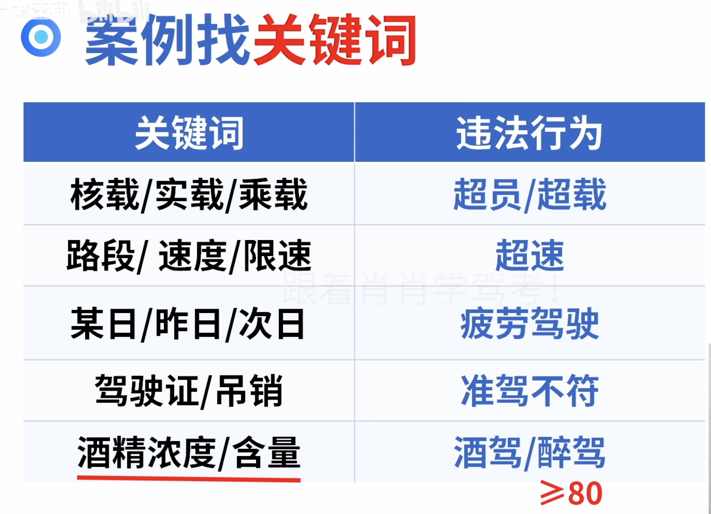
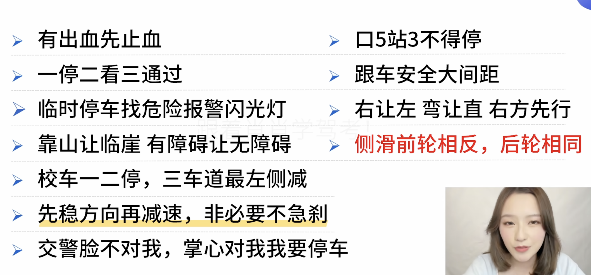

1. 关键词
    
    - 酒驾20-80
    - 疲劳驾驶4h休息20min
    
    大客车是a1
    城3公4城5公7（中心线） 
    
    - 例题
         
         
         
         
         
2. 交通信号
    
    
    
    
    
    特殊路段<30
    
    
    红高蓝低黄建议
    
    禁止驶入（车不行人可以）禁止通行（人车都不）
    
     
    
    
    
    
    
    
3. 安全文明
    
    
    
    放在头部保护颈部
    
    
    先全选再排除
    
    
    
    非必要不用远光灯，特别是会车
4. 事故避险
    
    先稳方向再减速；微微修正不能迅速；驻车制动是手刹
    
    
    
    
    
    
    
    
    
    
    
    从右侧车门离开
    
     
    
    
    
5. 现场急救
    
    搬运侧卧对不能仰卧
    
    
6. 特殊天气
    
    
    
    三车都直走右方先行；下坡让山坡
    高速上车速大于100，车距为100，小于车距为50；进入打左转离开打右转
    
    
    非机动车和行人都要先行
    
    
    
    
    
    
    